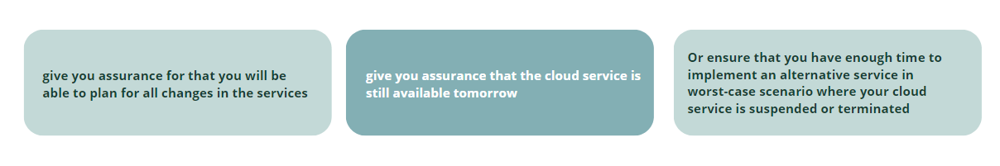

# Subscribing to IaaS/PaaS, general 

### When subscribing to Infrastructure as a Service (IaaS) or Platform as a Service (PaaS) from the hyperscalers, you normally need to accept their standardized subscription terms. 

We will guide you through the subscription terms for **Microsoft Azure, Amazon Web Services and Google Cloud Platform**, so you understand your rights and obligations.

Our comparison basis is a traditional sourcing/hosting agreement, and how the balance in the cloud subscription agreements may differ. A high-level summary of the differences is that the subscription agreements lack **“predictability” from a customer perspective**, at least if you focus on **business continuity.** 

## The average cloud subscription agreement does not

### There are however some ways to mitigate this risk. The risk is also affected by several other factors than merely the subscription terms as such. 

## 1. Different programs may have different protection. 

   If you purchase cloud services directly from the hyperscalers, you may purchase under different programs. For Azure, you may for instance subscribe under their Enterprise program (EA) (if you have 500 subscription licenses or more, and are a public customer), under their “new” Customer Agreement program (MCA) or under their Microsoft Online Services Agreement program (MOSA). For each of the hyperscalers we will guide you through the various programs benefits or potential drawbacks.

## 2. Subscription through a reseller may affect your rights and obligations.

   Generally speaking, when you buy cloud services from a hyperscaler through a reseller, you normally need to accept the hycperscalers subscription terms, through the agreement you sign with the reseller. 

## A key element here, is which contractual consequence this has for you as a customer

### **If acceptance of the hyperscalers subscription terms has the contractual consequence that you in reality enter into a direct agreement** with the relevant hyperscaler (in addition to the separate resale agreement with the reseller)**

- This means that you can enforce your rights directly towards the hyperscaler, and visa versa. 
- The reseller will not be a contractual party to such agreement, will not be a part of any disputes or claims for damages for instance if the cloud service is defective etc, except if related to payment for consumed cloud services.
- In such set-up you normally agree the subscription fee with the reseller and pay the reseller. This way of buying through a reseller, does not add any specific risks from a customer perspective, in addition to the subscription terms in itself, except that you may loose access to the cloud services if the reseller agreement for some reason is terminated. This since your account often is tied up to and dependent on the technical solutions of the reseller. 

### **As for the latter, there are also different reseller “tiers” and for some, we see that termination of the reseller agreement under some “tiers” has the consequence that the reseller loses its right to resell to existing customers from one day to the other, while under other “tiers” the reseller will be entitled to continue to deliver to existing customer for a transitional period from 1 month to a year depending on the hyperscaler and the programs. Such differences may affect you as a customer.** 

- If acceptance of the subscription terms does not create a direct agreement between you as a customer and the relevant hyperscaler, but you will normally still be contractually obliged to adhere to the subscription terms (is normally agreed in your agreement with the reseller) because the reseller is liable towards the hyperscaler for any breach of such terms by its end-customers. Such models are also frequently used, but we then see that the rights for the customers are weakened. For instance:
- The few rights the customer has according to the terms and conditions in the subscription terms, are not rights granted to you
- The obligations remain, since the reseller have no choice other than mirroring such against you (because the reseller is liable towards the hyperscaler for any breach of such terms by its end-customers)
- As there will be no direct agreement, you will not be offered a normal third-party infringement indemnity from the hyperscaler
- And there are for several of the hyperscalers a potential “domino effect”, where you are compliant with the Hyperscalers T&C’s, but where other customers are not, and then this may lead to suspension or termination towards you as well. 

             So ask your potential reseller to inform you of whether such risks exist or not.
