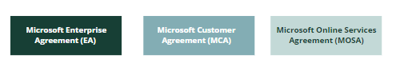

# Available programs, similarities and differences 

There are several different ways/programs to subscribe to Microsoft’s online services as a customer. The most relevant are: 

## Overview

- **Enterprise Agreement (EA)** can be used when you qualify for this. You need 500 SL’s or more (users and/or devices). Has traditionally been used when buying traditional software licenses but has for several years also covered online services. Normally you lock the subscription for 3-year periods at the time, and you get pricing based on a scaled volume discount system. You also have a “true-up” once a year, where you add/pay for additional users/devices etc (without an order as such when you start to use additional licenser). For software licenses its normally a limited possibility to scale down, while it is to some extent possible for online services once a year. Payment for the committed consumption is upfront in full. The big “minus” with this agreement is that it consists of many different agreement documents and is highly complex. But if you need to negotiate the terms, this is the program where Microsoft offers this as a possibility as of now. Note that private entities are not allowed any longer to subscribe to Azure services under the EA program, so unless you are an existing EA customer, this alternative is not available (nor upon renewal).  

- **Government Enterprise Agreement (EA)**, can be used when you have 250 SL’s or more.  
- **Microsoft Customer Agreement (MCA)** directly with Microsoft (MS Enterprise). 
- **Microsoft Customer Agreement (MCA)** through a reseller (MCA Indirect). The CSP program does not have a 3-year commitment as the EA, but billing is as a main rule done on a month by month basis; e.g its easier to scale up and down, and as a general rule you pay your consumption monthly in arrears (but options are available. Commitment is however needed to get good discounts). Your reseller/CSP will bill you and support you in case of incidents, SLA downtime, guide you as to optimizing your consumption/prices etc.   
- **Microsoft Online Services Agreement (MOSA)**. Simply register as a customer at Azure.com and enter your credit card.  
- **Others**, such as OL (open license), OSV, Select/Select+) are not available for purchase on Online-services. 

## Similarities and differences

The larges difference between Microsoft Enterprise agreement and Microsoft Customer agreement is as mentioned above that the Enterprise agreement offers “true-up” for some online-services, while all the general terms and conditions are more or less the same.  

MCA is obviously made with copy paste from the general terms and conditions in the EA. There are some minor differences, but most of them does not affect your rights or the general balance. We have only identified one majeure difference, which was introduces after the update of MCA with effect from 1. March 2023 – which is a more balanced regulation related to temporary suspension of the services.   

Since most companies now are pointed to the MCA program, and are not allowed to subscribe to Azure under EA, it does not make much sense to go into detail on the differences any more. When you look at the Product Terms, SLA and DPA, these are identical, as long as the same service offerings are available under both programs.  

MOSA has some differences to EA and MCA, but since this agreement only is used when customers register online, often in the starting process of exploring Azure, these also does not matter mush. As you are billed through a payment card, this model is not preferred anyway by customers that have extensive use and depend on the online services.  
