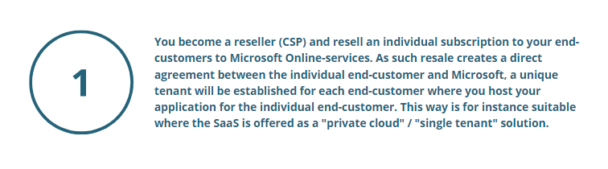
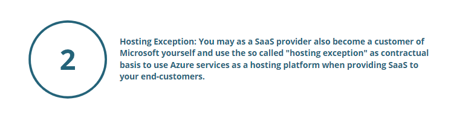

# General

Many software companies that offer SaaS to their end-customers, use Azure to hosting its applications. 
In order to use Azure to host your application and offer SaaS to your end-customers there are two ways to contract with Microsoft:

## You as a regular Microsoft Cloud Solution Partner 

 

## You as a SaaS-provider using the Hosting Exeption 

 

As a **customer of Microsoft**, the main rule is that you are not allowed to
share the services with third parties. **The "hosting exception"** however
allow you to use Azure as your hosting platform, provided your product
to end-customers are not the Microsoft Online-services as such, but
access to a "Customer Solution" such as your own **software application as a service**. As your
end-customers do not get access to Microsoft Online-services as such,
this is allowed by Microsoft.

In this situation you do not have to become a reseller (CSP) and enter
into a Microsoft Partner Agreement, but you use the "hosting exception"
in your own **customer agreement with Microsoft** as the legal basis to
utilize Microsoft Online services and offer **SaaS to end-customers**. It is
not a resale as such. The "hosting exception" is often used by SaaS
suppliers for **multitenant** SaaS offerings.

      Read more about your rights and obligations when using the hosting exception, "Hosting Exception-Detailed Walkthrough". 
      It also accounts for the benefits and risk with becoming a CSP or using the hosting exception for you as a SaaS provider.
